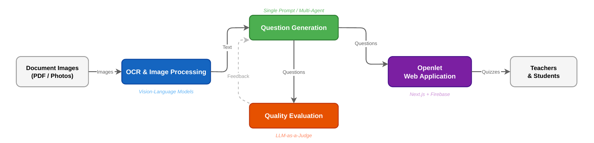
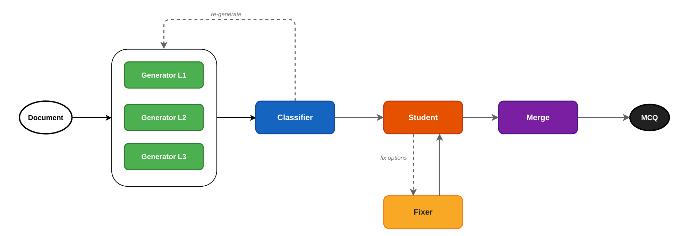
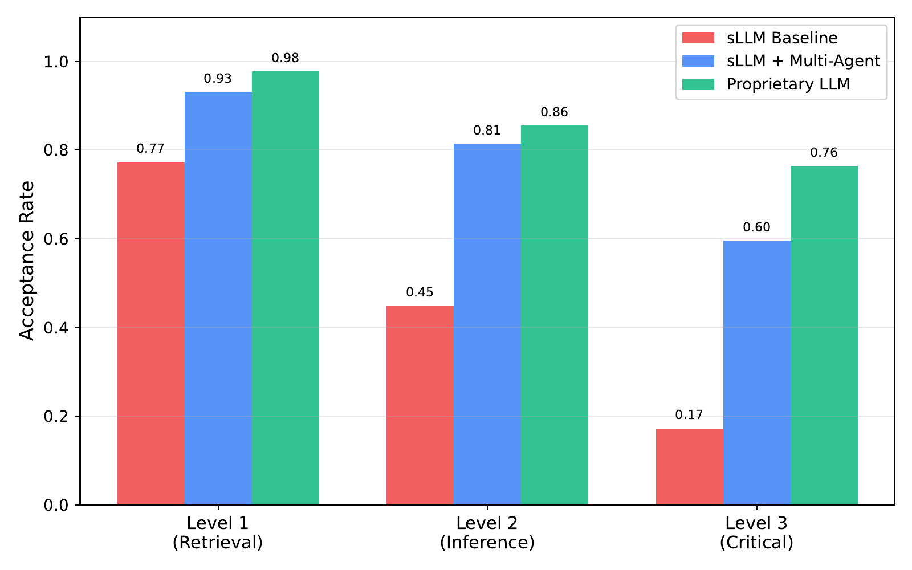
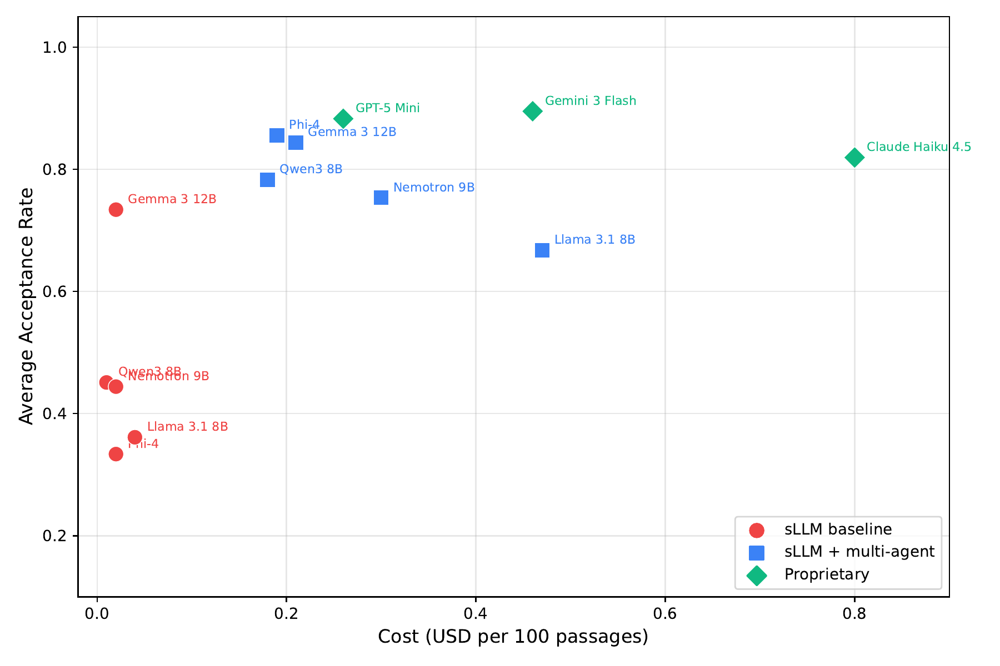
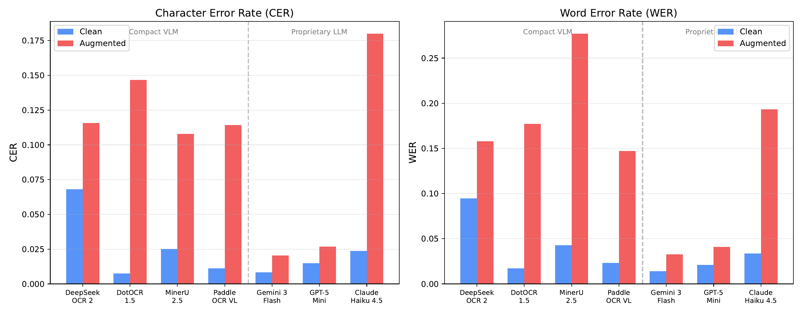
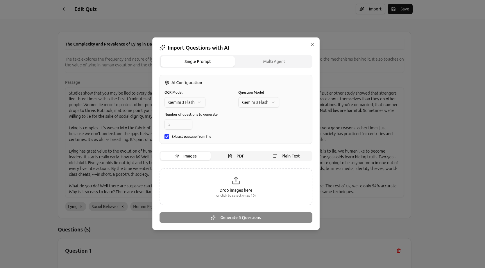
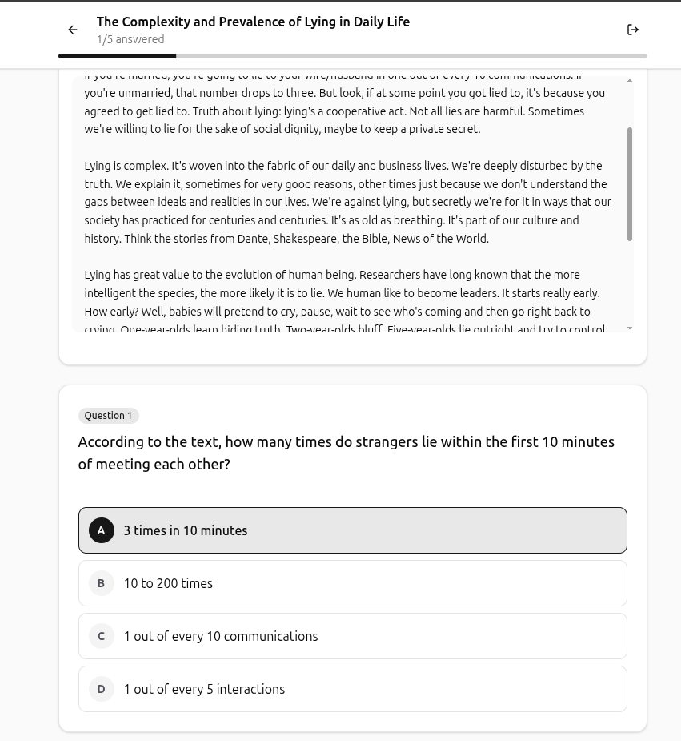
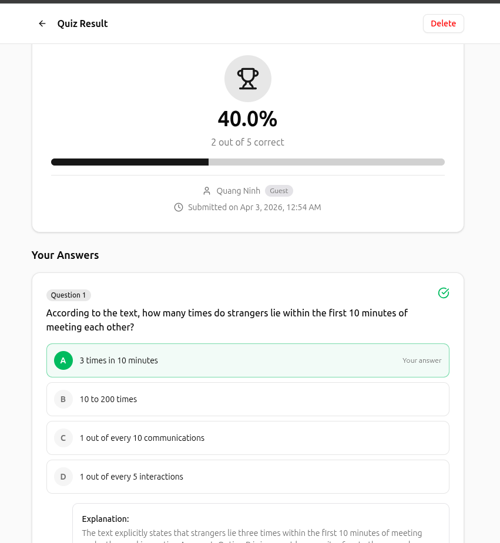

<div align="center">

# Openlet

**Automated Multi-Level MCQ Generation from Document Images via Multi-Agent LLMs**

[](https://python.org)
[](https://nextjs.org)
[](https://langchain-ai.github.io/langgraph/)
[](https://firebase.google.com)
[](LICENSE)

*A research framework and production web application for generating pedagogically-sound multiple-choice questions (MCQs) across three Bloom's Taxonomy cognitive levels - directly from photographed or scanned learning materials.*

</div>

---

## Table of Contents

- [Openlet](#openlet)
  - [Table of Contents](#table-of-contents)
  - [Overview](#overview)
  - [System Architecture](#system-architecture)
  - [Multi-Agent Pipeline](#multi-agent-pipeline)
  - [Key Features](#key-features)
  - [Benchmark Results](#benchmark-results)
    - [MCQ Quality](#mcq-quality)
      - [Acceptance Rate by Group and Level](#acceptance-rate-by-group-and-level)
      - [Cost vs. Quality (Pareto Frontier)](#cost-vs-quality-pareto-frontier)
      - [Detailed Results](#detailed-results)
    - [OCR Performance](#ocr-performance)
      - [Synthetic Augmentation Pipeline](#synthetic-augmentation-pipeline)
      - [Results Summary](#results-summary)
  - [Openlet Web Application](#openlet-web-application)
  - [Tech Stack](#tech-stack)
    - [Research Framework (Python)](#research-framework-python)
    - [Web Application (Next.js + Firebase)](#web-application-nextjs--firebase)
  - [Installation](#installation)
    - [Research Framework](#research-framework)
    - [Web Application (Demo)](#web-application-demo)
  - [Usage](#usage)
    - [Generate MCQs (Multi-Agent Pipeline)](#generate-mcqs-multi-agent-pipeline)
    - [Evaluate MCQ Quality](#evaluate-mcq-quality)
    - [Evaluate OCR](#evaluate-ocr)
    - [Reproduce Plots](#reproduce-plots)
  - [Project Structure](#project-structure)
  - [License](#license)

---

## Overview

Creating high-quality assessment questions is one of the most time-consuming tasks in education. Openlet addresses this by combining **Vision-Language Models (VLMs)** for OCR with a **multi-agent LLM pipeline** to automatically generate, classify, validate, and explain MCQs across three cognitive levels:

| Level | Bloom's Equivalent | Description |
|---|---|---|
| **Level 1** | Remember | Retrieval of explicit facts from the passage |
| **Level 2** | Understand / Apply | Inference, reasoning, and synthesis |
| **Level 3** | Analyze / Evaluate | Critical reasoning, logic traps, argumentation |

The core research question is whether **small open-source LLMs (sLLMs, 8–14B parameters)** - when orchestrated in a multi-agent system - can match the MCQ quality of large proprietary LLMs (GPT-5, Gemini, Claude) at a fraction of the cost.

> **Key finding:** Gemma 3 12B + Multi-Agent achieves **0.85 average acceptance rate** across all levels at only **$0.21 per 100 passages** - competitive with Gemini 3 Flash ($0.46) and outperforming Claude Haiku 4.5 ($0.80).

---

## System Architecture

The system is composed of four modules that work together end-to-end:



| Module | Role | Technology |
|---|---|---|
| **OCR & Image Processing** | Extract text from photos/PDFs | Compact VLMs, Proprietary LLMs |
| **Question Generation** | Generate multi-level MCQs | Single Prompt or Multi-Agent pipeline |
| **Quality Evaluation** | Score solvability, alignment, distractor quality | LLM-as-a-Judge (G-Eval) |
| **Openlet Web App** | Teacher/student-facing interface | Next.js + Firebase |

---

## Multi-Agent Pipeline

The research version uses a **Hub-and-Spoke with Dynamic Fan-out** architecture built on [LangGraph](https://langchain-ai.github.io/langgraph/), enabling iterative quality improvement through two independent retry phases.



**Pipeline flow:**

```
Document ──► Generator L1 ┐
             Generator L2 ├──► Classifier ──► Student ──► Merge ──► MCQ Set
             Generator L3 ┘        │              │
                              re-generate       Fixer
                           (if level wrong)   (if wrong answer)
```

**Agents:**

- **Generator L1 / L2 / L3** - Three parallel agents, each specialised for one cognitive level. Use in-context positive/negative examples from prior rounds.
- **Classifier** - Verifies the cognitive level of each question using *ephemeral ID remapping* to prevent position bias. Triggers regeneration for misclassified questions.
- **Student** - Simulates a student solving each question (higher temperature). Flags questions that cannot be solved correctly from the passage.
- **Fixer** - Repairs answer options (not the question stem) for questions the Student failed on.
- **Merge** - Collects all `PASSED` questions, caps at *N* per level, assigns final sequential IDs.

**Anti-deadlock:** A forced progression mechanism advances items that exceed `max_loops`, preventing infinite retry cycles. Forced items are flagged in the output.

---

## Key Features

- 📄 **Multi-format input** - JPEG/PNG photos, multi-page PDFs (auto-split into per-page images)
- 🧠 **Three cognitive levels** - Level 1 (Retrieval), Level 2 (Inference), Level 3 (Critical reasoning)
- 🤖 **Two generation modes** - Single Prompt (fast, cheap) vs. Multi-Agent (high quality)
- 🔁 **Iterative quality loops** - Classifier and Student/Fixer phases independently retry up to `max_loops` times
- 🏷️ **Anti-bias classification** - Ephemeral ID remapping eliminates position bias in the Classifier
- 📊 **Automated evaluation** - LLM-as-a-Judge with Solvability, Alignment, Acceptance, and Distractor Quality metrics
- 💰 **Cost tracking** - Thread-safe OpenRouter API cost accumulation per run
- 🌐 **Full web app** - Teachers create quizzes; students take them online with timer, feedback, and leaderboards
- 🔌 **Model-agnostic** - Any model reachable via [OpenRouter](https://openrouter.ai) works out of the box

---

## Benchmark Results

All experiments run on **100 passages sampled from RACE-High** (English reading comprehension exams for high school students). Each configuration generates up to 5 questions per cognitive level per passage (1,500 questions total). Judge model: **Gemini 3 Flash**.

### MCQ Quality

Three evaluation metrics, all computed by an LLM judge:

- **Solvability** - The judge correctly identifies the single right answer from the passage alone (binary 0/1).
- **Alignment** - The judge's predicted cognitive level matches the target level (binary 0/1).
- **Acceptance** = Solvability × Alignment (both must pass).
- **Distractor Quality** - Fraction of the 3 distractors that are pedagogically valid for the question's level (0–1).

#### Acceptance Rate by Group and Level



| Group | Level 1 | Level 2 | Level 3 |
|---|---|---|---|
| sLLM Baseline | 0.77 | 0.45 | 0.17 |
| **sLLM + Multi-Agent** | **0.93** | **0.81** | **0.60** |
| Proprietary LLM | 0.98 | 0.86 | 0.76 |

The multi-agent system brings sLLM performance within **5–16 percentage points** of proprietary models - at a fraction of the cost.

#### Cost vs. Quality (Pareto Frontier)



**Pareto-optimal choice:** `Gemma 3 12B + Multi-Agent` at **$0.21 / 100 passages** achieves 0.85 average acceptance - matching GPT-5 Mini in quality while costing **38% less**.

#### Detailed Results

<details>
<summary>sLLM Baseline</summary>

| Model | L1 Acc. | L1 Align. | L1 Dist. | L2 Acc. | L2 Align. | L2 Dist. | L3 Acc. | L3 Align. | L3 Dist. |
|---|---|---|---|---|---|---|---|---|---|
| Gemma 3 12B | 0.908 | 0.960 | 0.874 | 0.778 | 0.870 | 0.675 | 0.516 | 0.730 | 0.499 |
| Qwen3 8B | 0.830 | 0.904 | 0.814 | 0.404 | 0.510 | 0.252 | 0.119 | 0.214 | 0.095 |
| Phi-4 | 0.602 | 0.841 | 0.486 | 0.281 | 0.421 | 0.168 | 0.119 | 0.235 | 0.075 |
| Nemotron Nano 9B v2 | 0.760 | 0.846 | 0.735 | 0.484 | 0.594 | 0.357 | 0.089 | 0.173 | 0.075 |
| Llama 3.1 8B Instruct | 0.764 | 0.894 | 0.710 | 0.300 | 0.472 | 0.189 | 0.020 | 0.062 | 0.013 |

</details>

<details>
<summary>sLLM + Multi-Agent</summary>

| Model | L1 Acc. | L1 Align. | L1 Dist. | L2 Acc. | L2 Align. | L2 Dist. | L3 Acc. | L3 Align. | L3 Dist. |
|---|---|---|---|---|---|---|---|---|---|
| Gemma 3 12B | 0.958 | 0.994 | 0.933 | 0.838 | 0.960 | 0.780 | 0.736 | 0.992 | 0.660 |
| Qwen3 8B | 0.909 | 0.990 | 0.859 | 0.858 | 0.975 | 0.711 | 0.581 | 1.000 | 0.507 |
| Phi-4 | 0.975 | 0.996 | 0.941 | 0.907 | 0.971 | 0.790 | 0.685 | 1.000 | 0.619 |
| Nemotron Nano 9B v2 | 0.923 | 0.978 | 0.896 | 0.782 | 0.921 | 0.703 | 0.556 | 0.982 | 0.497 |
| Llama 3.1 8B Instruct | 0.893 | 0.985 | 0.823 | 0.686 | 0.962 | 0.545 | 0.423 | 0.998 | 0.350 |

</details>

<details>
<summary>Proprietary LLM (Baseline)</summary>

| Model | L1 Acc. | L1 Align. | L1 Dist. | L2 Acc. | L2 Align. | L2 Dist. | L3 Acc. | L3 Align. | L3 Dist. |
|---|---|---|---|---|---|---|---|---|---|
| Gemini 3 Flash | 0.982 | 0.990 | 0.965 | 0.928 | 0.932 | 0.898 | 0.775 | 0.814 | 0.898 |
| GPT-5 Mini | 0.980 | 0.992 | 0.973 | 0.824 | 0.832 | 0.739 | 0.845 | 0.903 | 0.805 |
| Claude Haiku 4.5 | 0.970 | 0.990 | 0.945 | 0.816 | 0.834 | 0.727 | 0.672 | 0.754 | 0.638 |

</details>

<details>
<summary>API Cost per 100 passages (USD)</summary>

| Group | Model | Cost |
|---|---|---|
| sLLM Baseline | Gemma 3 12B | $0.02 |
| sLLM Baseline | Qwen3 8B | $0.01 |
| sLLM Baseline | Phi-4 | $0.02 |
| sLLM Baseline | Nemotron Nano 9B v2 | $0.02 |
| sLLM Baseline | Llama 3.1 8B Instruct | $0.04 |
| sLLM + Multi-Agent | Gemma 3 12B | **$0.21** |
| sLLM + Multi-Agent | Qwen3 8B | $0.18 |
| sLLM + Multi-Agent | Phi-4 | $0.19 |
| sLLM + Multi-Agent | Nemotron Nano 9B v2 | $0.30 |
| sLLM + Multi-Agent | Llama 3.1 8B Instruct | $0.47 |
| Proprietary LLM | Gemini 3 Flash | $0.46 |
| Proprietary LLM | GPT-5 Mini | $0.26 |
| Proprietary LLM | Claude Haiku 4.5 | $0.80 |

</details>

---

### OCR Performance

Seven models evaluated on 100 RACE-High passages rendered as synthetic document images, under two conditions: **clean** (ideal quality) and **augmented** (noise, blur, tilt, stains simulating real-world photos).



#### Synthetic Augmentation Pipeline

Document text is rendered as a realistic image (randomised fonts, layouts, column counts), then degraded with [Augraphy](https://github.com/sparkfish/augraphy) to simulate physical noise.

<p align="center">
  
</p>

#### Results Summary

| Model | Type | CER (Clean) | CER (Aug.) | WER (Clean) | WER (Aug.) |
|---|---|---|---|---|---|
| DotOCR 1.5 | Compact VLM | **0.0075** | 0.1467 | **0.0172** | 0.1771 |
| PaddleOCR VL 1.5 | Compact VLM | 0.0113 | 0.1143 | 0.0232 | 0.1473 |
| MinerU 2.5 | Compact VLM | 0.0252 | 0.1079 | 0.0427 | 0.2769 |
| DeepSeek OCR 2 | Compact VLM | 0.0681 | 0.1158 | 0.0948 | 0.1579 |
| **Gemini 3 Flash** | Proprietary | 0.0084 | **0.0204** | 0.0141 | **0.0326** |
| GPT-5 Mini | Proprietary | 0.0150 | 0.0269 | 0.0209 | 0.0409 |
| Claude Haiku 4.5 | Proprietary | 0.0238 | 0.1799 | 0.0337 | 0.1932 |

**Key finding:** Gemini 3 Flash and GPT-5 Mini maintain strong performance under noise (CER ×2.4 and ×1.8 respectively), while compact VLMs degrade 10–20× - underscoring that noise robustness depends on training strategy, not model size alone. Claude Haiku 4.5 is an outlier among proprietary models, degrading similarly to compact VLMs.

---

## Openlet Web Application

Openlet is a full-stack web application that brings the research pipeline to teachers and students.

**Teacher flow:** Upload a document photo or PDF → choose generation mode → review/edit AI-generated questions → publish with a shareable link.

**Student flow:** Open the link → take the timed quiz → receive instant feedback with explanations.

<table>
<tr>
<td align="center" width="50%">

<br><em>Quiz editor with AI import dialog (Single Prompt / Multi-Agent, configurable model)</em>
</td>
<td align="center" width="50%">

<br><em>Student quiz interface with passage, question, and answer options</em>
</td>
</tr>
<tr>
<td align="center" colspan="2">

<br><em>Result page with score, per-question feedback, and AI-generated explanations</em>
</td>
</tr>
</table>

**Notable app features:**
- 🔐 **Role-based access** - Quiz owner has full edit/manage rights; test-takers see only what the owner allows
- 🕵️ **Server-side grading** - Correct answers never reach the client; grading happens entirely on the server
- 📊 **Configurable feedback** - 5 visibility levels from "show nothing" to "show full explanation"
- ⏱️ **Timer support** - Optional countdown with auto-submit
- 📈 **Statistics dashboard** - Score distribution, leaderboard, per-question analytics
- 👤 **Anonymous access** - Students can take quizzes without registering (Firebase anonymous auth)

---

## Tech Stack

### Research Framework (Python)

| Library | Purpose |
|---|---|
| [LangGraph](https://langchain-ai.github.io/langgraph/) | Multi-agent graph orchestration |
| [LangChain OpenAI](https://python.langchain.com/) | LLM client abstraction |
| [OpenRouter](https://openrouter.ai) | Unified API gateway for 100+ models |
| [Augraphy](https://github.com/sparkfish/augraphy) | Document image noise augmentation |
| [OpenCV](https://opencv.org/) | Image preprocessing |
| [Pyppeteer](https://github.com/pyppeteer/pyppeteer) | Headless browser for clean image generation |
| [jiwer](https://github.com/jitsi/jiwer) | CER / WER metrics |
| [Rich](https://github.com/Textualize/rich) | Terminal UI, progress tables |

### Web Application (Next.js + Firebase)

| Technology | Purpose |
|---|---|
| [Next.js 15](https://nextjs.org) | Full-stack React framework (App Router) |
| [React](https://react.dev) | UI library |
| [Tailwind CSS v4](https://tailwindcss.com) | Utility-first styling |
| [shadcn/ui](https://ui.shadcn.com) + [Radix UI](https://www.radix-ui.com) | Accessible component primitives |
| [Firebase Auth](https://firebase.google.com/products/auth) | Email + anonymous authentication |
| [Cloud Firestore](https://firebase.google.com/products/firestore) | Document database (quizzes + attempts) |
| [Cloud Storage](https://firebase.google.com/products/storage) | Temporary image/PDF upload storage |
| [Cloud Functions v2](https://firebase.google.com/products/functions) | Server-side OCR, generation, grading |
| [OpenRouter](https://openrouter.ai) | LLM API gateway (AI tier) |

---

## Installation

### Research Framework

**Requirements:** Python 3.10+, an [OpenRouter API key](https://openrouter.ai/keys).

```bash
# Clone the repository
git clone https://github.com/your-username/openlet-research.git
cd openlet-research

# Create a virtual environment
python -m venv .venv
source .venv/bin/activate  # Windows: .venv\Scripts\activate

# Install dependencies
pip install -r requirements.txt

# Configure environment
cp .env.example .env
# Edit .env and set OPENROUTER_API_KEY=your_key_here
```

### Web Application (Demo)

**Requirements:** Node.js 18+, a Firebase project, an OpenRouter API key.

```bash
cd demo

# Install Node dependencies
npm install

# Configure environment
cp .env.example .env.local
# Fill in Firebase config and OPENROUTER_API_KEY in .env.local

# Start development server
npm run dev
# Open http://localhost:3000
```

> **Firebase setup:** Create a project at [console.firebase.google.com](https://console.firebase.google.com), enable Authentication (Email/Password + Anonymous), Firestore, Storage, and Functions, then copy the config values into `.env.local`.

---

## Usage

### Generate MCQs (Multi-Agent Pipeline)

```bash
# Generate 5 questions per level for 100 RACE-High passages
python main.py \
  --sources race \
  --n 5 \
  --model "google/gemma-3-12b-it" \
  --max-loops 8 \
  --verbose

# Use Single Prompt mode (faster, cheaper)
python question.py \
  --sources race \
  --n 5 \
  --model "google/gemma-3-12b-it"
```

Output is written to `outputs/race/<model_id>/predictions.json`.

### Evaluate MCQ Quality

```bash
python eval.py \
  --model "google/gemma-3-12b-it" \
  --judge-model "google/gemini-flash-1.5" \
  --sources race \
  --workers 16 \
  --verbose
```

Results are written to `outputs/race/<model_id>/eval.json`.

### Evaluate OCR

```bash
# Generate synthetic images from dataset passages
python augment_images.py --sources race

# Run OCR evaluation on clean and augmented images
python ocr_eval.py \
  --model "google/gemini-flash-1.5" \
  --data-dir outputs/
```

### Reproduce Plots

```bash
python docs/report/scripts/generate_plots.py
# Figures saved to docs/report/output/figures/
```

---

## Project Structure

```
openlet-research/
│
├── main.py                  # Multi-agent MCQ generation (LangGraph)
├── question.py              # Single-prompt MCQ generation
├── eval.py                  # LLM-as-a-Judge quality evaluation
├── ocr_api.py               # OCR extraction via VLMs
├── ocr_eval.py              # CER/WER evaluation for OCR models
├── augment_images.py        # Synthetic noisy image generation (Augraphy)
├── clean_images.py          # Clean image rendering (Pyppeteer)
├── format_eval.py           # Evaluation output formatting
├── requirements.txt         # Python dependencies
│
├── prompts/                 # LLM prompt templates
│   ├── v5/                  # Multi-agent prompts (l1_generator, classifier, student, fixer …)
│   └── eval.md              # Judge evaluation prompt
│
├── datasets/
│   └── race/                # RACE dataset passages
│
├── outputs/
│   └── race/
│       └── <model_id>/
│           ├── predictions.json   # Generated MCQs
│           └── eval.json          # Evaluation results
│
├── demo/                    # Next.js web application
│   ├── app/                 # App Router pages & layouts
│   ├── components/          # React components (quiz, editor, results …)
│   ├── functions/           # Firebase Cloud Functions (Python)
│   │   ├── main.py          # Single-pass multi-agent pipeline (demo)
│   │   ├── prompts.py       # Prompt templates
│   │   └── parser.py        # LLM output parsers
│   └── package.json
│
└── docs/
    └── reports/
        ├── figures/         # All figures used in the thesis & README
        └── scripts/         # Plot generation scripts
```

---

## License

This project is licensed under the **MIT License** - see the [LICENSE](LICENSE) file for details.