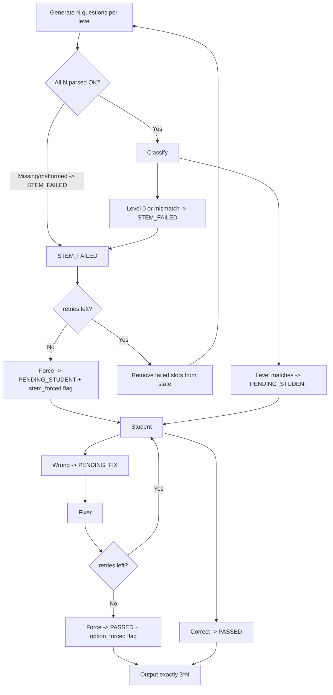

# Data Flow

```mermaid
flowchart TD
    Gen["Generate N questions per level"] --> Parse{"All N parsed OK?"}
    Parse -->|Yes| Classify
    Parse -->|"Missing/malformed -> STEM_FAILED"| StemFailed
    Classify --> Match["Level matches -> PENDING_STUDENT"]
    Classify --> Mismatch["Level 0 or mismatch -> STEM_FAILED"]
    Mismatch --> StemFailed["STEM_FAILED"]
    StemFailed --> Retry1{"retries left?"}
    Retry1 -->|Yes| Remove["Remove failed slots from state"]
    Remove --> Gen
    Retry1 -->|No| Force1["Force -> PENDING_STUDENT + stem_forced flag"]
    Force1 --> Student
    Match --> Student
    Student --> Correct["Correct -> PASSED"]
    Student --> Wrong["Wrong -> PENDING_FIX"]
    Wrong --> Fixer --> Retry2{"retries left?"}
    Retry2 -->|Yes| Student
    Retry2 -->|No| Force2["Force -> PASSED + option_forced flag"]
    Force2 --> FinalOutput
    Correct --> FinalOutput
    FinalOutput["Output exactly 3*N"]
```
